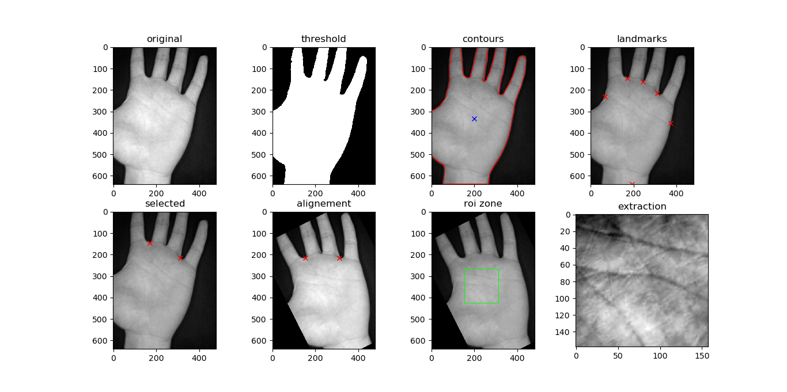

# PROIE

***A simple python script called PROIE (Palmprint Region Of Interest Extraction) forked from : [Link to Project](https://github.com/safwankdb/Effectual-Palm-RoI-Extraction).***

***The method is proposed by Kekre et al. [1]. The original paper can be found in : [Link to Paper](https://ieeexplore.ieee.org/abstract/document/6398207)***

---

## Table of Contents

- [Installation](#installation)
- [Built With](#built-with)
- [Basic Usage](#basic-usage)
- [Features](#features)
- [Contributing](#contributing)
- [References](#references)
- [License](#license)

---

## Installation

> **Important** : *there is no need for installation.*

In order to use it, you must follow these steps:

1. Clone the repository `https://github.com/yyaddaden/PROIE`,
2. Extract all the Python files,
3. Open the command line prompt,
4. Use it with the instructions below (see [Basic Usage](#basic-usage)).

## Built With

This projet is built using these technologies:

- Programming Language: **Python**
- Libraries: 
  - **OpenCV**: https://opencv.org/
  - **Matplotlib**: https://matplotlib.org/
  - **Numpy**: https://github.com/numpy/numpy
- Code Editor: **Microsoft Visual Studio Code**

> **Important** : *the libraries listed above must be installed in order to use the script.*

## Basic Usage

In order to use the script, you have to edit the script `example.py`. The figure below show the obtained results (image from CASIA Palmprint Dataset) :

## Features

This Python script `PROIE.py` includes several methods:

1. The main method to extract the *Region of Interest* : `extract_roi(path_in_img, rotate=False)`,
2. Displaying the obtained results as in the figure above : `show_result()`, 
3. Saving the extacted *Region of Interest* : `save(path_out_img)`.

## Contributing

> In order to contribue to this projet, there are two options :

- **Option 1** : 🍴 Fork this repo or check the original project `https://github.com/safwankdb/Effectual-Palm-RoI-Extraction`
- **Option 2** : 👯 Clone this repo to your local machine using `https://github.com/yyaddaden/PROIE.git`

## References

**[1]** `Kekre, H. B., Sarode, T., & Vig, R. (2012, October). An effectual method for extraction of ROI of palmprints. In 2012 International Conference on Communication, Information & Computing Technology (ICCICT) (pp. 1-5). IEEE.`

## License

